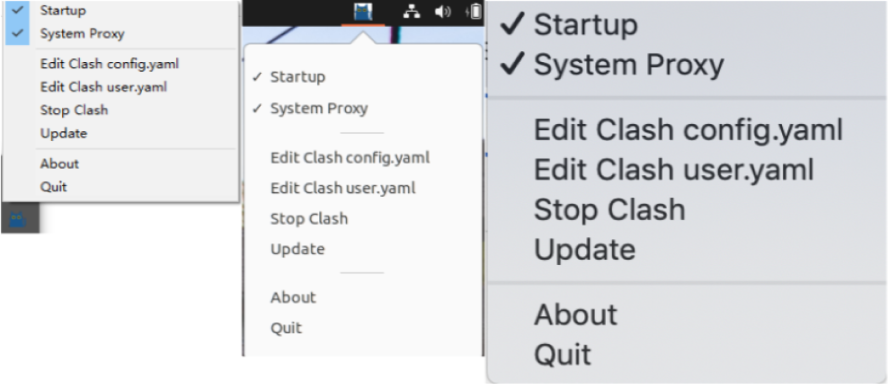
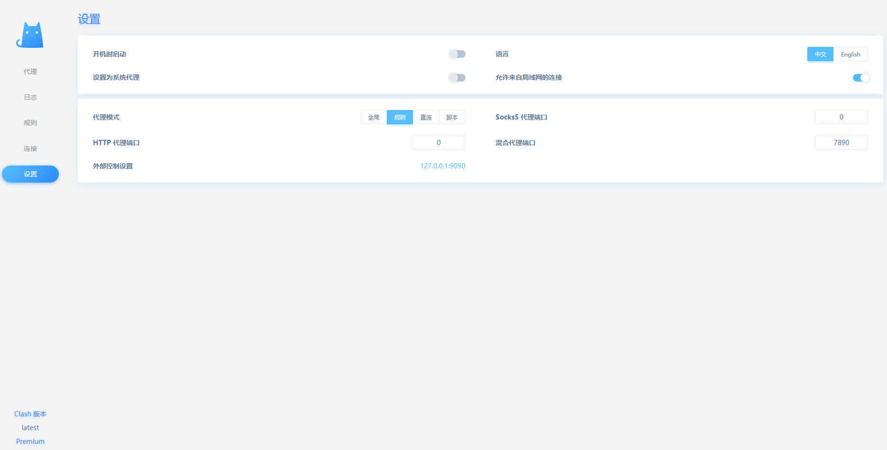

<div align="center">

# ClashWeb

ClashWeb is a cross-platform lightweighted wrapper for [Clash Premium](https://github.com/Dreamacro/clash/releases/tag/premium) on Desktop environment.

[](https://github.com/ctaoist/clashweb/actions) [](https://github.com/ctaoist/clashweb/blob/master/LICENSE)



http://127.0.0.1:9090/ui:



</div>

## Features

- Supported on Windows, MacOS, and Linux
- Startup after operating-system reboot
- Set system proxy
- Update Clash Premium
- Change the WebUI: yacd/razord

>Note: The TUN mode of the Clash Premium need **root or administrator privilege**.

## Usage

1. Download ClashWeb from [Releases](https://github.com/ctaoist/clashweb/releases)
2. Edit clash config.yaml
3. Run ClashWeb

>With First running, the Clash Premium need to download Country.mmdb, ~6Mb.

## Install

### Pre-compiled

[Releases](https://github.com/ctaoist/clashweb/releases)

### From source code

After building the app, you need to download the latest [clash premium](https://release.dreamacro.workers.dev/latest/) into `./App/` folder.

For **Linux**, building apps requires `gcc` as well as the `gtk3` and `libayatana-appindicator3` development headers to be installed. For Debian or Ubuntu, you may install these using:

```sh
sudo apt-get install gcc libgtk-3-dev libayatana-appindicator3-dev
```

On Linux Mint, `libxapp-dev` is also required.

For **Windows**, to avoid opening a console at application startup, use these compile flags:

```sh
go build -ldflags "-H=windowsgui"
```

For **MacOS**, you will need to create an application bundle to wrap the binary; simply folders with the following minimal structure and assets:

```
SystrayApp.app/
  Contents/
    Info.plist
    MacOS/
      go-executable
    Resources/
      SystrayApp.icns
```

When running as an app bundle, you may want to add one or both of the following to your Info.plist:

```
    <!-- avoid having a blurry icon and text -->
	<key>NSHighResolutionCapable</key>
	<string>True</string>

	<!-- avoid showing the app on the Dock -->
	<key>LSUIElement</key>
	<string>1</string>
```

## Credits

- https://github.com/Dreamacro/clash
- https://github.com/Dreamacro/clash-dashboard
- https://github.com/haishanh/yacd
- https://github.com/getlantern/systray
- https://github.com/gen2brain/beeep


## License

This software is released under the [GPL3.0](https://github.com/ctaoist/clashweb/blob/master/LICENSE) license.
